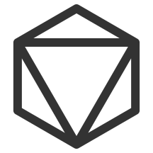

  
# D&D Dice 
  

  

## D&D Die Roller 

Use D&D Dice Roller to easily roll any number any dice, with modifiers and more

https://rgbstudios.org/dnd-dice

## Character Roller 

https://rgbstudios.org/dnd-dice/char.html

Use D&D Character Roller to easily roll stats for a new D&D character, complete with graphs, download, and more

# Spell Searcher 

https://rgbstudios.org/dnd-dice/spell.html

Search for D&D spells and find description, range, class, level, and more

https://github.com/rgbstudios/dnd-dice

RGB Studios

https://rgbstudios.org

https://facebook.com/rgbstudios.org

<a href="mailto:contact@rgbstudios.org">contact@rgbstudios.org</a>

https://github.com/rgbstudios

